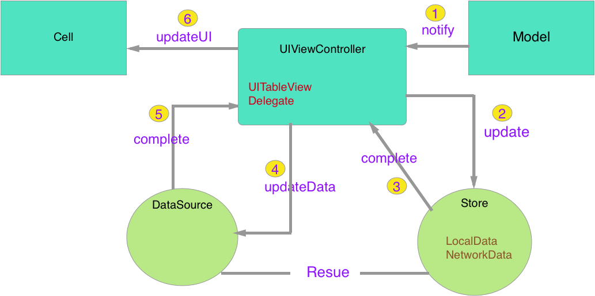
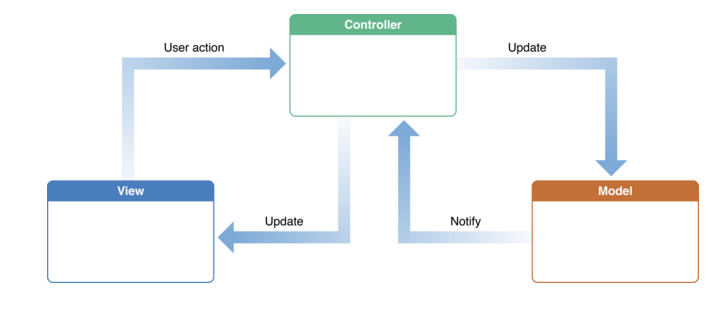

# MVC-Objective-C




###1. viewController 知道有哪几种model
###2. viewController 给 store model和数据获取方式
###3. store 请求等方式获取数据,解析成model放入数组转给viewController
###4. viewController 传数据源和cell信息给DataSource,配置cell布局
###5. DataSource配置完成
###6. viewController回调控制cell显示,cell交互

####Tip: 
* 之后数据更新2-6循环 
* ####DataSource:(tbView的数据源代理)和 Store(tbView的数据来源) 可用于多个tbView


#Usage
================
```
ConfigCellBlock block = ^(id cell, id item) {
        [cell configData:item];
}
_dataSource = [[DataSource alloc] initWithItem:dataArr
                                cellIdentifier:CellIdentifier
                               configCellBlcok:block];
_tbView.dataSource = _dataSource;                                                                              
```

###appendix
多种cell类型初始化

```
- (instancetype)initWithItem:(NSArray *)item
             cellIdentifiers:(NSArray *)aCellIdentifiers
         cellRelateIndexPath:(NSDictionary *)relateDict
             configCellBlcok:(ConfigCellBlock)aConfigCellBlcok;
```


```
DataSource.h

/** cell状态全局,优先级低于回调 */
@property (nonatomic, assign) UITableViewCellSelectionStyle cellSelectionStyle;

/** Header-title */
@property (nonatomic, strong) NSArray *headerArr;
/** Footer-title */
@property (nonatomic, strong) NSArray *footerArr;
/** section索引 */
@property (nonatomic, strong) NSArray *sectionIndex;
```

##Reference
=====
####[objc-更轻量的VC](http://objccn.io/issue-1/)

